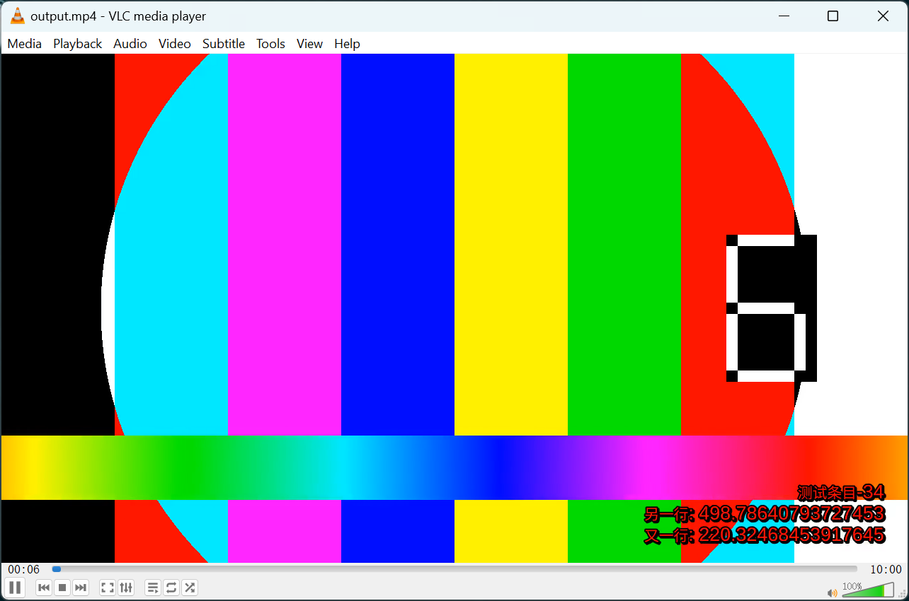

# Java ASSA(Advanced Sub Station Alpha) Library

🚧 Yet another Java ASSA implementation.
This is an open-source library designed for structured creation of ASSA (Advanced Sub Station Alpha) using Java.

## Getting Started

### Prerequisites

To use this library, you will need:
**Java 17** or higher (Because I used two features: `Record` and `Text Blocks`)

### Installing

You can add this library to your project as a dependency via Maven:

```xml

<dependency>
    <groupId>io.github.since1986</groupId>
    <artifactId>assa</artifactId>
    <version>1.0.0</version>
</dependency>
```

### Usage

#### simple example

Here is a simple example of how to create a ASSA:

```java
void genSubtitle() throws IOException {
    var start = LocalTime.of(0, 0, 0);
    var random = new Random();
    var dialogues = new ArrayList<Dialogue>();
    for (
            int i = 0;
            i < 2000; i++) {
        var end = start.plus(200, ChronoUnit.MILLIS);
        var payload = "测试条目-%s\\N另一行: %s\\N又一行: %s".formatted(
                i,
                random.nextDouble(999.999),
                random.nextDouble(999.999)
        );
        var dialogue = Dialogue.builder()
                .start(start)
                .end(end)
                .tex(payload)
                .build();
        dialogues.
                add(dialogue);
        start = end;
    }
    var advancedSubStationAlpha = new AdvancedSubStationAlpha(
            ScriptInfo.builder().build(),
            Style.builder()
                    .fontsize(12)
                    .primaryColour("&H000000FF")
                    .alignment(Style.Alignment.RIGHT_BOTTOM)
                    .build(),
            new Event(dialogues.toArray(new Dialogue[]{}))
    );
    Files.writeString(Path.of("input.ass"), advancedSubStationAlpha.toString(), StandardOpenOption.CREATE, StandardOpenOption.TRUNCATE_EXISTING);
}
```

Create a 10-minute test video: Use the command to generate a test video with a duration of 10 minutes.

```shell
ffmpeg -f lavfi -i testsrc=duration=600:size=1280x720:rate=30 -f lavfi -i sine=frequency=1000:duration=600 -c:v libx264 -c:a aac -strict experimental input.mp4
```

Combine the ASSA file generated from the example above with the video file to create an mp4 file with hard subtitles: Execute the command.

```shell
ffmpeg -i input.mp4 -vf "subtitles=input.ass" -threads 4 -c:v libx264 -c:a copy output.mp4
```

Play the resulting mp4 file in VLC to check the effects.



**NOTE:** The test uses hard subtitles (which means the subtitle text and style are burned onto the video frames). If soft subtitles are used, the player cannot properly render the subtitle styles, and the reason for this is pending investigation.

## Contributing

Welcome contributions to this project. Please fork the repository and submit a pull request.

## License

This project is licensed under the Apache License Version 2.0 License see the [LICENSE](LICENSE) file for details.

## Acknowledgments

* Thanks to all the contributors who have helped to improve this library.

## Resources

[ASS_Tags](https://aegi.vmoe.info/docs/3.1/ASS_Tags/)

[SubStation_Alpha](https://fileformats.fandom.com/wiki/SubStation_Alpha)

[Line Spacing in SubStation Alpha](https://www.md-subs.com/line-spacing-in-ssa)

